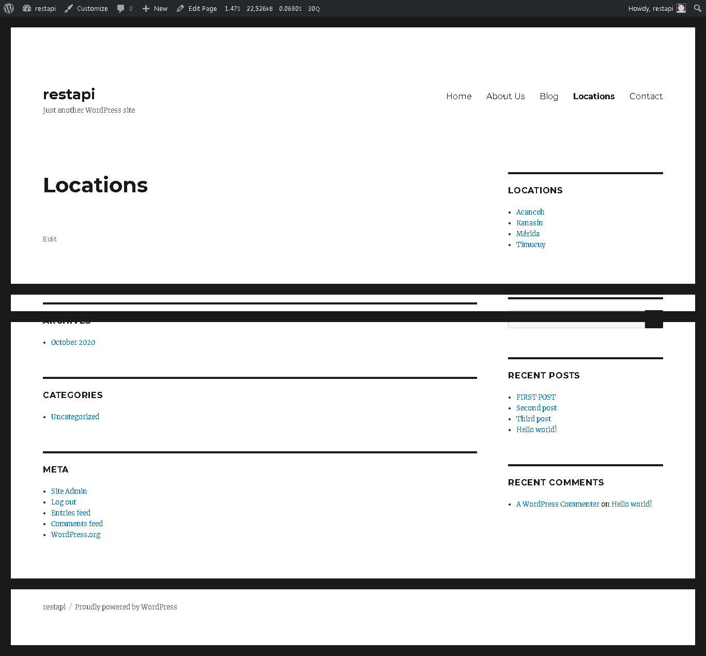

# WordPress 5.5.1

## Plugin Name: Section Menus

### Description: Add a section menu to the sidebar

:diamond_shape_with_a_dot_inside: Version: 0.1
:diamond_shape_with_a_dot_inside: Author: Cheche Pech
:diamond_shape_with_a_dot_inside: Author URI: https://chechepech.gq
* :diamond_shape_with_a_dot_inside: License: GPL2
* :diamond_shape_with_a_dot_inside: License URI: https://www.gnu.org/licenses/gpl-2.0.html
* :diamond_shape_with_a_dot_inside: Domain Path: /languages
* :diamond_shape_with_a_dot_inside: Text Domain: mymenu

|  |  | Follow me! Cheché Pech |  |  |
| --- | --- | :---: | ---| --- |
| :beers: [linkedin](https://www.linkedin.com/in/chechepech) | :beers: [facebook](https://www.facebook/chechepech) | :beers: [twitter](https://twitter.com/chechepech) | :beers: [instagram](https://www.instagram.com/cheche_pech) | :beers: [youtube](https://www.youtube.com/c/chechepech)  |